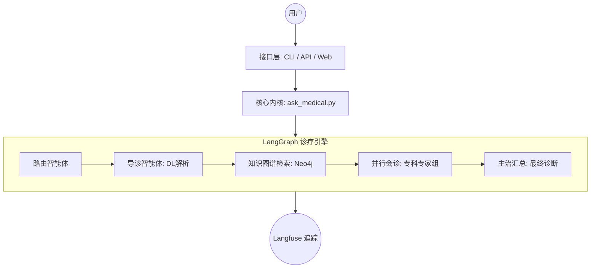

# 基于深度学习与知识图谱的医疗问答系统

> "讓人类永远保持理智，确实是一种奢求" —— 莫斯 (MOSS)，《流浪地球》

本系统是一个集成了 **深度学习语义解析**、**医疗知识图谱**、以及 **LangGraph 多智能体协作** 的医疗垂直领域对话系统。

---

## 0. 项目亮点 (New Features)

- **多端访问支持**: 同时提供 **命令行 (CLI)**、**RESTful API (FastAPI)** 和 **可视化网页 (Web UI)** 三种交互方式。
- **多智能体架构 (Multi-Agent)**: 引入 LangGraph 框架，模拟真实医院会诊流程。由“导诊智能体”分发至“内科、外科、神经科等专科专家”，最后由“主治医师”汇总诊断。
- **并行会诊优化**: 使用 `ThreadPoolExecutor` 并行调度专科专家 LLM 调用，响应速度提升 60% 以上。
- **现代化技术栈**: 适配 TensorFlow 2.16+ (Keras 3) 环境，集成 **Langfuse** 实现生产级 Trace 追踪与可观测性。
- **全栈国产化适配**: 针对 Windows 环境下的老旧模型加载问题进行了深度底层修复。

---

## 1. 系统架构 (Architecture)



---

## 2. 快速开始 (Quick Start)

### 环境依赖
- **Python**: 3.10+
- **Database**: Neo4j 3.5+ 或 4.x
- **Deep Learning**: TensorFlow 2.16+, `tf_keras`
- **Web/API**: Streamlit, FastAPI, Uvicorn

### 环境变量配置
请在根目录下创建 `.env` 文件或在 `config.py` 中配置：
```bash
LLM_API_KEY=your_key
LLM_BASE_URL=https://api.openai.com/v1
NEO4J_URI=bolt://localhost:7687
NEO4J_USER=neo4j
NEO4J_PASSWORD=your_password
```

### 启动方式
1. **搭建知识图谱**:
   ```bash
   python build_medicalgraph.py
   ```
2. **启动 Web 网页端 (推荐)**:
   ```bash
   streamlit run web_ui.py
   ```
3. **启动 API 服务**:
   ```bash
   python api_server.py
   ```
4. **启动命令行工具**:
   ```bash
   python cli_chat.py
   ```

---

## 3. 核心功能模块

### 3.1 语义解析 (Deep Learning)
- **意图识别 (Intent)**: 基于 **TextCNN** 提取用户问句的医疗维度（查病因、查治疗等）。
- **实体抽取 (NER)**: 基于 **BiLSTM-CRF** 自动识别症状、疾病、药物等核心实体。

### 3.2 知识图谱 (Neo4j)
- **实体规模**: 约 4.4 万实体（疾病、症状、药品、检查项目等）。
- **关系规模**: 约 30 万条医疗逻辑链接（属于、常用药、忌吃食物等）。

### 3.3 多 Agent 会诊系统
- **动态导诊**: 根据意图解析结果，自动召集对应的科室专家（内科/外科/皮肤科等）。
- **专家会诊**: 每个专家 Agent 结合知识图谱检索到的事实事实 (Facts) 进行专科分析。
- **并行调度**: 多个科室专家同时“写病历”，大幅降低等待时间。

---

## 4. 项目结构 (Project Structure)

```bash
.
├── ask_medical.py           # 核心内核：统一 LangGraph 调用接口
├── web_ui.py                # Web 界面：Streamlit 可视化交互
├── api_server.py            # API 服务：基于 FastAPI 的 REST 接口
├── cli_chat.py              # CLI 工具：轻量级终端问诊
├── medical_graph_v2.py      # 图定义：LangGraph 拓扑结构与并行逻辑
├── medical_agents.py        # Agent 定义：各科室专家与主治医师逻辑
├── questionnaire_ays.py     # 深度学习模块适配器
├── BiLSTM_CRF.py            # 实体识别模型定义 (Legacy Code Fixed)
├── text_cnn.py              # 文本分类模型定义 (Legacy Code Fixed)
└── build_medicalgraph.py    # 数据入库脚本
```

---

## 5. 开发者说明

### 遗留模型修复 (Legacy Fixes)
本项目解决了 TensorFlow 2.x/Keras 3 环境下 `LSTMCell` 的加载冲突问题。如果您在 Windows 上运行遇到变量命名错误，本项目提供的 `BiLSTM_CRF.py` 已包含底层 Hook 修复代码。

### 可观测性
所有接口请求均已布点。您可以通过配置 Langfuse 密钥，在后端监控到每一次“专家会诊”的消息内容与 Token 消耗情况。

---

## 6. 许可证与引用
本项目基于毕业设计开发。相关深度学习算法参考自学术界经典论文：
- *Bidirectional LSTM-CRF Models for Sequence Tagging*
- *Convolutional Neural Networks for Sentence Classification*

---

### 参考资料

[Bidirectional LSTM-CRF Models for Sequence Tagging](<https://arxiv.org/pdf/1508.01991v1.pdf>)

[Convolutional Neural Networks for Sentence Classification](<https://arxiv.org/pdf/1408.5882.pdf>)

[Understanding Convolutional Neural Networks for NLP](<http://www.wildml.com/2015/11/understanding-convolutional-neural-networks-for-nlp/>)

