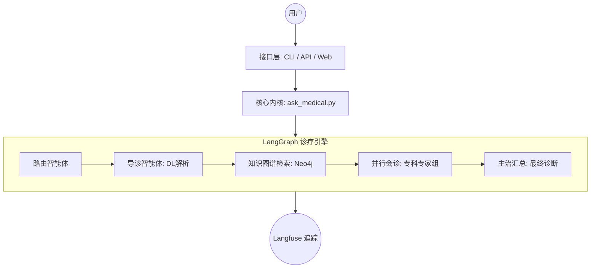

# 基于深度学习与知识图谱的医疗问答系统

> "讓人类永远保持理智，确实是一种奢求" —— 莫斯 (MOSS)，《流浪地球》

本系统是一个集成了 **深度学习语义解析**、**医疗知识图谱**、以及 **LangGraph 多智能体协作** 的医疗垂直领域对话系统。

---

## 0. 项目亮点 (New Features)

- **多端访问支持**: 同时提供 **命令行 (CLI)**、**RESTful API (FastAPI)** 和 **可视化网页 (Web UI)** 三种交互方式。
- **多智能体架构 (Multi-Agent)**: 引入 LangGraph 框架，模拟真实医院会诊流程。由“导诊智能体”分发至“内科、外科、神经科等专科专家”，最后由“主治医师”汇总诊断。
- **并行会诊优化**: 使用 `ThreadPoolExecutor` 并行调度专科专家 LLM 调用，响应速度提升 60% 以上。
- **现代化技术栈**: 适配 TensorFlow 2.16+ (Keras 3) 环境，集成 **Langfuse** 实现生产级 Trace 追踪与可观测性。
- **全栈国产化适配**: 针对 Windows 环境下的老旧模型加载问题进行了深度底层修复。

---

## 1. 系统架构 (Architecture)



---

## 2. 快速开始 (Quick Start)

### 环境依赖
- **Python**: 3.10+
- **Database**: Neo4j 3.5+ 或 4.x
- **Deep Learning**: TensorFlow 2.16+, `tf_keras`
- **Web/API**: Streamlit, FastAPI, Uvicorn

### 环境变量配置
请在根目录下创建 `.env` 文件或在 `config.py` 中配置：
```bash
LLM_API_KEY=your_key
LLM_BASE_URL=https://api.openai.com/v1
NEO4J_URI=bolt://localhost:7687
NEO4J_USER=neo4j
NEO4J_PASSWORD=your_password
```

### 启动方式
1. **搭建知识图谱**:
   ```bash
   python build_medicalgraph.py
   ```
2. **启动 Web 网页端 (推荐)**:
   ```bash
   streamlit run web_ui.py
   ```
3. **启动 API 服务**:
   ```bash
   python api_server.py
   ```
4. **启动命令行工具**:
   ```bash
   python cli_chat.py
   ```

---

## 3. 核心功能模块

### 3.1 语义解析 (Deep Learning)
- **意图识别 (Intent)**: 基于 **TextCNN** 提取用户问句的医疗维度（查病因、查治疗等）。
- **实体抽取 (NER)**: 基于 **BiLSTM-CRF** 自动识别症状、疾病、药物等核心实体。

### 3.2 知识图谱 (Neo4j)
- **实体规模**: 约 4.4 万实体（疾病、症状、药品、检查项目等）。
- **关系规模**: 约 30 万条医疗逻辑链接（属于、常用药、忌吃食物等）。

### 3.3 多 Agent 会诊系统
- **动态导诊**: 根据意图解析结果，自动召集对应的科室专家（内科/外科/皮肤科等）。
- **专家会诊**: 每个专家 Agent 结合知识图谱检索到的事实事实 (Facts) 进行专科分析。
- **并行调度**: 多个科室专家同时“写病历”，大幅降低等待时间。

---

## 4. 项目结构 (Project Structure)

```bash
.
├── ask_medical.py           # 核心内核：统一 LangGraph 调用接口
├── web_ui.py                # Web 界面：Streamlit 可视化交互
├── api_server.py            # API 服务：基于 FastAPI 的 REST 接口
├── cli_chat.py              # CLI 工具：轻量级终端问诊
├── medical_graph_v2.py      # 图定义：LangGraph 拓扑结构与并行逻辑
├── medical_agents.py        # Agent 定义：各科室专家与主治医师逻辑
├── questionnaire_ays.py     # 深度学习模块适配器
├── BiLSTM_CRF.py            # 实体识别模型定义 (Legacy Code Fixed)
├── text_cnn.py              # 文本分类模型定义 (Legacy Code Fixed)
└── build_medicalgraph.py    # 数据入库脚本
```

---

## 5. 开发者说明

### 遗留模型修复 (Legacy Fixes)
本项目解决了 TensorFlow 2.x/Keras 3 环境下 `LSTMCell` 的加载冲突问题。如果您在 Windows 上运行遇到变量命名错误，本项目提供的 `BiLSTM_CRF.py` 已包含底层 Hook 修复代码。

### 可观测性
所有接口请求均已布点。您可以通过配置 Langfuse 密钥，在后端监控到每一次“专家会诊”的消息内容与 Token 消耗情况。

---

## 6. 许可证与引用
本项目基于毕业设计开发。相关深度学习算法参考自学术界经典论文：
- *Bidirectional LSTM-CRF Models for Sequence Tagging*
- *Convolutional Neural Networks for Sentence Classification*

---
© 2024 Elipuka Medical AI Team.
��于情感分类 </em>
	</p>
</p>

图片来至[详解BiLSTM及代码实现](<https://segmentfault.com/p/1210000016830547/read#top>)

tensorflow中tf.nn.dynamic_rnn函数

```python
outputs, state = tf.nn.dynamic_rnn(
    cell,
    inputs,
    sequence_length=None,
    initial_state=None,
    dtype=None,
    parallel_iterations=None,
    swap_memory=False,
    time_major=False,
    scope=None
)
其中两个返回值：
outputs: The RNN output Tensor. this will be a Tensor shaped: [batch_size, max_time, cell.output_size].

state: The final state. If cell.state_size is an int, this will be shaped [batch_size, cell.state_size]. 
```

第一个输出`outputs`就是一批数据的中间状态输出的集合（张量）。第二个输出`state`就是LSTM最后一个状态，

它含了一个方向的所有信息

##### CRF层

CRF的`转移矩阵A`由神经网络的CRF学习得到，而`发射概率矩阵P` 就是由Bi-LSTM的输出来作近似模拟。

这样有了（A,P,$\pi$）就可以调用viterbi算法进行解码做预测了

<p align="center">
	
	<p align="center">
		<em> Bi-LSMT+CRF </em>
	</p>
</p>
##### 损失函数及反向传播

损失函数用的tensorflow的`crf.crf_log_likelihood`，对数似然函数

目标函数是的`-tf.reduce_mean(crf.crf_log_likelihood)`，即对数自然函数的均值的负数，这和LR回归的目标函数一样

反向传播更新参数，进行下一批数据前向传播训练


##### 循环网络结构与超参数

a）使用句子分词后词的词向量作为输入，

b）dropout的值调到0.5，

c）句子的最大长度sentence_length调到30以下（我使用的20），

d）句子填充那里使用的0填充，

e）语料中实体种类数目做平衡（不出现某个种类严重偏执，否者就回导致预测偏执严重和过拟合），

f）语料标注使用的BIOES标注（之前用的BIO标注）

训练出来模型的F1值可以达到0.98，


| 参数名          | 参数值  |
| --------------- | ------- |
| lstm 隐藏层维度 | 600     |
| 学习速率        | 0.00075 |
| batch_size      | 100     |
| 句子截断长度    | 25      |
| 梯度截断        | [-5,5]  |
| 标签数目        | 13      |
| 训练时dropout   | 0.5     |
| 句子填充        | 0值填充 |
| 句子标注方式    | BIOES法 |

#### 用户意图识别

通过命名实体识别模型正确提取出问句中询问的医疗实体之后，还需要理解用户问句的意图，其意图的具体表现就是医疗实体的关系或属性，即需要进行问句意图和知识库关系的映射。考虑医疗问诊场景的用户问题通常是短文本，因此本项目将用户意图识别设定为短文本分类任务

##### 数据嵌入人工特征

数据同样用冷启动的方式获得大量数据，然后将在上一轮识别出来的命名实体类别嵌入到句子中，增加句子的区分度

```
得了感冒要吃啥药
嵌入人工特征：
得了感冒disease要吃啥药
```

##### 模型选择

由n-gram语言模型可知，自然语言存在局部特征，卷积神经网络（CNN）可用来提取局部特征，如今常被用于表示句子级别的信息和短文本分类任务，结合识别出的医疗实体实现用户问句的意图理解。

短文本有其特点，局部信息可决定句子意图，比如像`我头疼发烧流鼻涕，这是啥病`与问句`这是啥病，我最近发烧流鼻涕头疼`里面的整体与局部语序换了，但是句子意图没有变，所以短文本适用于CNN。长文本可用LSTM，attention，有大量训练语料则bert有优势，需要快速但精确度要求不高可用fasttext模型。

##### 嵌入层

将词表示成具有相同长度的词向量，句子就可表示成词向量的矩阵，一个二维的矩阵，这个矩阵可以类比为一张单通道的图片，若图片时RGB三通道图片，则在这里，我们的词可以采用不同的嵌入方式，比如字嵌入，或者golve形式的词向量，这样就可得到多层的句子词向量矩阵。

<p align="center">
	
	<p align="center">
		<em> textCNN词的嵌入 </em>
	</p>
</p>
##### 卷积层


1. 一个长度为n的句子被视为N个word的拼接(concatenation)，每个word 的embedding有k维，则concat后的句子表示为一个N x k的矩阵，即神经网络的输入
2. 由于图像是二维（长和宽）三通道(RGB)，而句子是一维的（word按顺序拼接）（可以L通道，即使用L种不同的embedding方法，就可以形成L层输入为N x k的矩阵），因此这里的CNN的filter（卷积核）的大小都为h x k（h为卷积核所围窗口中单词的个数） ，即每个filter扫过的区域是从上往下覆盖到h个word的所有embedding长度
3. 根据n-gram模型，可选取几个不同大小(h不同的)filter去学习句子的不同的局部特征，得到不同的feature map。


##### 池化层

在得到每个卷积核的feature map之后，要做一个max-pooling，即max(c)

max-pooling的用处是：
 1.使得可以输入不同长度的句子。长度不同的sentence经过这个卷积核后得到的特征都为1维
 2.能够有效抓取句子的最突出特征。比如一个卷积核是用来检测是否存在not like这样的负面评论，则不论出现该模式出现在句子的哪里，前面还是后面，这个卷积核都能取得很高的卷积值。

当然Pooling会损失句子的order信息，比如最显著的模式出现的位置（句子的前面还是后面），因此又多种基于Pooling的优化：如k-max pooling（保留feature map中K个最大的值）或者dynamic k-max pooling （sentence分为几段，每一段取一个最大值）

##### 全连接及SoftMax分类层

一个句子从输入卷积层，再到最大池化后的数据，拼接成一个向量（一共有多少个feature map，这个向量就有多少维），然后喂入全连接层。比如作13分类，则全链接的输出就是13维的向量

最后接一层全连接的 softmax 层，输出每个类别的概率。

注意：一般之后还会过一个tf.argmax函数过程，就是将向量中最大的概率变那一位为1，其余变成0

##### 卷积网络结构与超参数

| 参数                 | 值                             |
| -------------------- | ------------------------------ |
| 嵌入层（词向量）维度 | 200                            |
| 卷积核尺寸           | h=2,3,4   此外不做填充，步长=1 |
| 卷积核个数           | 各种尺寸各128个                |
| dropout_keep_prob    | 0.5                            |
| batch_size           | 300                            |
| 预测类别             | 9                              |
| 学习率               | 0.0001                         |
| l2正则化系数         | 3                              |

另外还指定了句子截断长度为20，textcnn可以不用要求指定输入句子的长度，但是发现tensorflow运行时会说不指明input的所有维度会分配很多内存，以免溢出，就会占用大量内存，所以指明了。

一个textcnn的参考图

<p align="center">
	
	<p align="center">
		<em> textCNN </em>
	</p>
</p


#### 回答生成

知识图谱三元组<实体，关系，实体>或者是<实体，属性，属性值>

前面抽取的“医疗命名实体”就三元组的第一个元素——实体

前面进行的“用户意图识别”则是三元组中的第二个元素——关系/属性

得到三元组的这两个元素就可以用cypher语言在neo4j图数据库中进行查找对应的实体或属性值，然后构建回答返回给用户

```
    def sql_transfer(self, question_type, entities):
        if not entities:
            return []

        # 查询语句
        sql = []
        # 查询疾病的原因
        if question_type == 'disease_cause':
            sql = ["MATCH (m:Disease) where m.name = '{0}' return m.name, m.cause".format(i) for i in entities]

        # 查询疾病的防御措施
        elif question_type == 'disease_prevent':
            sql = ["MATCH (m:Disease) where m.name = '{0}' return m.name, m.prevent".format(i) for i in entities]

        # 查询疾病的持续时间
        elif question_type == 'disease_lasttime':
            sql = ["MATCH (m:Disease) where m.name = '{0}' return m.name, m.cure_lasttime".format(i) for i in entities]

        # 查询疾病的治愈概率
        elif question_type == 'disease_cureprob':
            sql = ["MATCH (m:Disease) where m.name = '{0}' return m.name, m.cured_prob".format(i) for i in entities]
		'''
		...
		'''
        return sql
```


### 参考资料

[Bidirectional LSTM-CRF Models for Sequence Tagging](<https://arxiv.org/pdf/1508.01991v1.pdf>)

[Convolutional Neural Networks for Sentence Classification](<https://arxiv.org/pdf/1408.5882.pdf>)

[Understanding Convolutional Neural Networks for NLP](<http://www.wildml.com/2015/11/understanding-convolutional-neural-networks-for-nlp/>)

